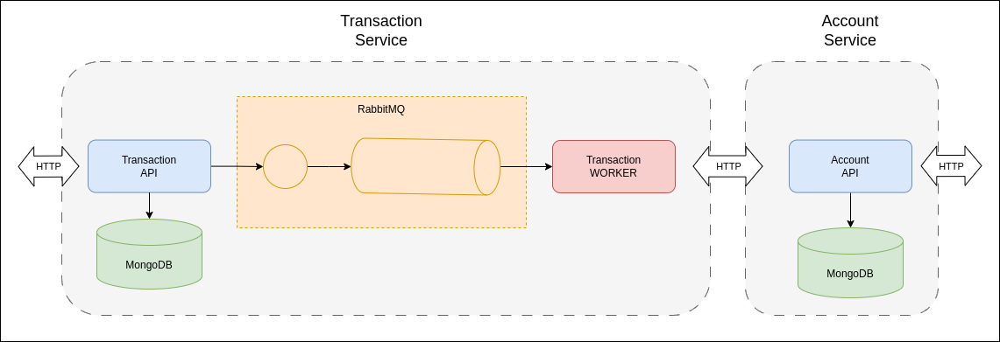

# Tach ARG Challenge

Este repositorio se compone de 2 proyectos con sus respectivos directorios `account-service`y `transaction-service`.

## Account Service:
   
   Este proyecto consiste de un microservicio REST API(sanic server) diseñado para administrar las cuentas de usuario.
   Este servicio se conecta con un MongoDB para guardar los datos de las cuentas.

   Componentes:
   - Account API (sanic)
   - MongoDB

## Transaction Service:

   Este proyecto se compone de un microservicio REST API(sanic server) diseñado para la creacion de transacciones de dinero. 
   Estas transacciones seran dirigidas a un servicio adicional (worker) donde se finalizara la transaccion, actualizando las cuentas de los usuarios involucrados en el mismo. 

   La idea consiste en que estos servicios(Transaction API -> Transaction WORKER) se comuniquen mediante una cola de mensajeria (RabbitMQ), generando eventos de transacciones asincronas.

   Tambien se usara MongoDB para almacenar los datos de las transacciones.

   Componentes:
   - Transaction API (sanic)
   - Transaction WORKER (pika)
   - RabbitMQ
   - MongoDB

## Diagramas:




1. Se realiza una peticion HTTP POST a `Transaction API` para crear una nueva transaccion.

2. `Transaction API` envia el ID de la transaccion a `RabbitMQ` y guarda los datos de la transaccion en MongoDB con un estado en pending.

3. `RabbitMQ` envia el ID de la transaccion a una queue hasta que el `Transaction WORKER` lo reciba.

4. Una vez `Transaction WORKER` recibe el ID de la transaccion envia una peticion HTTP GET a `Transaction API`.

5. `Transaction API` devuelve todos los datos de la transaccion.

6. `Transaction WORKER` realiza una peticion HTTP GET para obtener datos de las cuentas a `Account API`.

7. Una vez obtenidos los datos de las cuentas `Transaction WORKER` actualiza las cuentas realizando peticiones HTTP PUT a `Account API`.

8. Por ultimo `Transaction WORKER` actualiza el estado de la transaccion a done mediante una peticion HTTP PUT a `Transaction API`.

## Como ejecuto los proyectos?

Ambos proyectos se pueden ejecutar independientemente del otro haciendo uso de docker compose.
Puede encontrar un README en cada uno de ellos que lo guiaran en la instalacion y ejecucion.

Igualmente en este directorio principal del repositorio podra encontrar un `docker-compose.yml` que le permitira ejecutar ambos proyectos en conjunto.

Solo ejecute el comando de docker compose en el directorio principal del repositorio, al igual que los proyectos, como requisito necesita tener instalado Docker & docker compose:
```
docker compose up
```
Para detener los servicios puede ejecutar el siguiente comando:
```
docker compose stop
```
   
Si desea limpiar todos los datos guardados en MongoDB puede eliminar los volumenes de docker:
```
docker compose down -v
```

***Puedes ver la configuracion de la ejecucion docker en el archivo `docker-compose.yml`.***
***Tambien puedes revisar todos los comandos disponibles de [docker compose](https://docs.docker.com/compose/reference/).***

## API Documentacion

Para probar los servicios REST API usted dispone de una UI documentando todos los endpoints disponibles de los mismos.

* Transaction API:
    - http://localhost:8000/docs
    - http://localhost:8000/docs/redoc
    - http://localhost:8000/docs/swagger

* Account API:
    - http://localhost:8080/docs
    - http://localhost:8080/docs/redoc
    - http://localhost:8080/docs/swagger

Los puertos de los servicios son diferentes,  esto es asi para que ambos servicios se ejecuten al mismo tiempo y no tengan problemas de red.
Usted puede modificar los puertos expuestos en el archivo `docker-compose`.

## RabbitMQ

RabbitMQ dispone de una UI para controlar o revisar el estado las queue y los consumidores conectados:

- http://localhost:15672

Las credenciales para acceder se encuentran en el archivo `.env`.
Al igual que los servicios REST API puede configurar el puerto en el archivo `docker-compose.yml`.

## MongoDB

Para acceder a la base datos puede usar una herramienta externa y conectarse a esta usando:

- mongodb://localhost:27017

Puede usar [MongoDB Shell](https://www.mongodb.com/docs/mongodb-shell/) o [MongoDB Compass](https://www.mongodb.com/docs/compass/master/), esta ultimo se uso para trabajar en este proyecto.
Al igual que los otros servicios puede configurar el puerto en el archivo `docker-compose.yml`.

